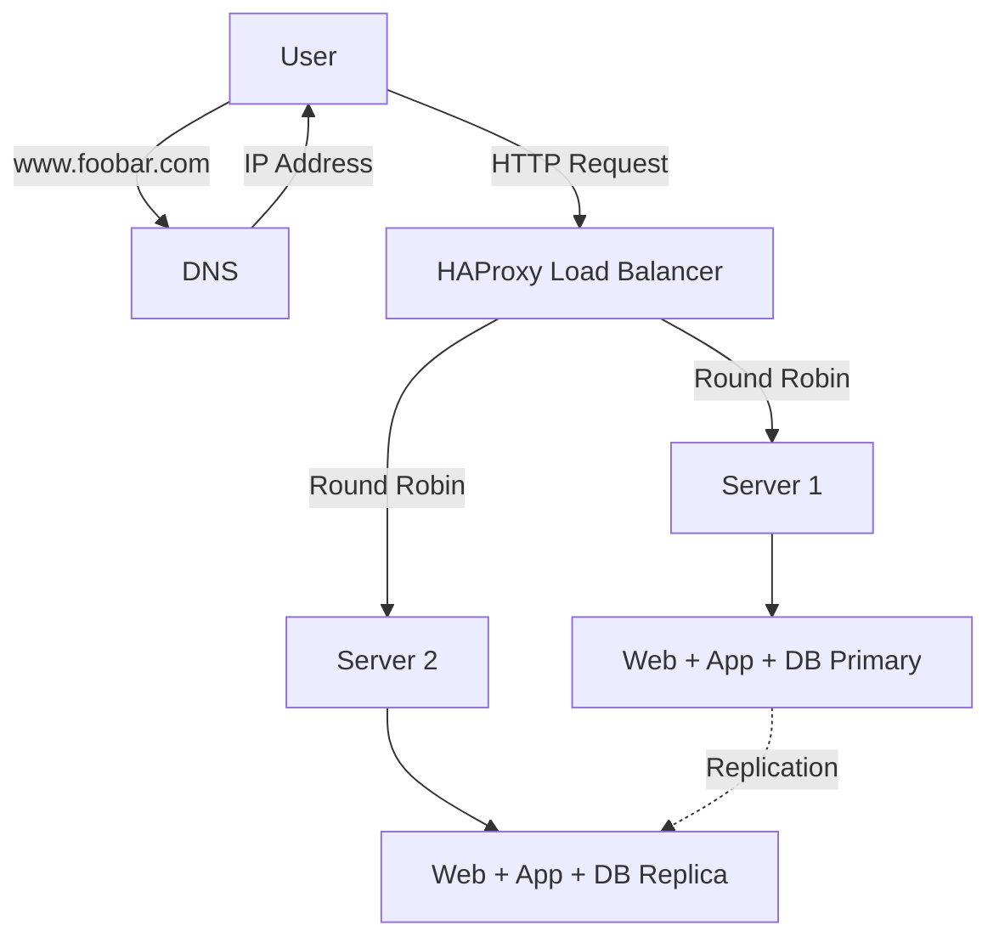

# Three Server Web Infrastructure Design

## Infrastructure Overview

## Why Add Each Component

### Load Balancer (HAProxy)
Distributes traffic between servers. If one server fails, traffic goes to the other. Improves performance by sharing the load.

### Second Server
Provides backup if first server fails. Handles more traffic by splitting the work.

### Database Replication
Primary database handles writes. Replica database handles reads and provides backup data.

## Load Balancer Configuration

### Distribution Algorithm: Round Robin
Sends requests in order: Request 1 to Server 1, Request 2 to Server 2, Request 3 to Server 1, etc.

### Active-Active Setup
Both servers handle traffic simultaneously.
- **Active-Active**: Both servers work at the same time
- **Active-Passive**: One server works, other waits as backup

## Database Setup

### Primary-Replica Cluster
- Primary database receives all write operations (INSERT, UPDATE, DELETE)
- Primary sends changes to Replica database
- Replica database stays synchronized with Primary

### Primary vs Replica Roles
- **Primary**: Handles writes, can handle reads
- **Replica**: Only handles reads, receives data from Primary

## Infrastructure Issues

### Single Points of Failure (SPOF)
- **Load Balancer**: If HAProxy fails, entire site goes down
- **Primary Database**: If Primary fails, no writes possible

### Security Issues
- **No Firewall**: Servers exposed directly to internet attacks
- **No HTTPS**: Data travels unencrypted, can be intercepted

### No Monitoring
- Can't detect when servers fail
- No visibility into performance problems
- No alerts when issues occur

## Summary

This setup improves on single server by adding redundancy and load distribution, but still has critical failure points and security gaps that need addressing for production use.