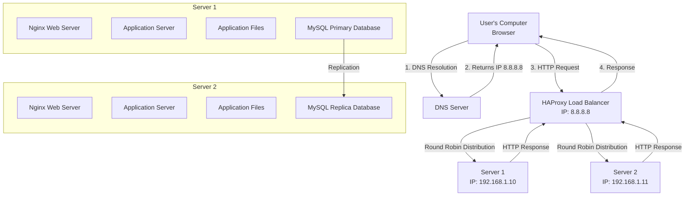

# Three Server Web Infrastructure Design

## Infrastructure Overview

## Step-by-Step Process: User Accessing www.foobar.com

### 1. DNS Resolution
- User types `www.foobar.com` in browser
- DNS server returns load balancer IP `8.8.8.8`

### 2. Load Balancer Processing
- **HAProxy** receives HTTP request on IP `8.8.8.8`
- Uses configured algorithm to select target server
- Forwards request to chosen server (Server 1 or Server 2)

### 3. Server Processing
- Selected server's **Nginx** receives the request
- Nginx serves static files or forwards to application server
- **Application server** processes business logic using application files
- May query database (Primary for writes, either for reads)

### 4. Database Operations
- **Primary database** (Server 1): Handles all write operations
- **Replica database** (Server 2): Receives replicated data, handles read operations
- Data synchronization ensures consistency

### 5. Response Path
- Server generates response and sends back through load balancer
- HAProxy forwards response to user's browser

## Infrastructure Components Explained

### Why Add a Load Balancer (HAProxy)?
**Purpose**: Distributes incoming requests across multiple servers to:
- **Eliminate single point of failure** for web services
- **Improve performance** by spreading load across servers
- **Enable horizontal scaling** by adding more backend servers
- **Provide health checking** to route traffic only to healthy servers
- **Enable maintenance** without complete service interruption

### Load Balancer Distribution Algorithm: Round Robin
**How it works**:
- Requests are distributed sequentially across available servers
- Request 1 → Server 1, Request 2 → Server 2, Request 3 → Server 1, etc.
- Simple and ensures even distribution when requests are similar
- **Alternative algorithms**: Least connections, weighted round robin, IP hash

### Active-Active vs Active-Passive Setup

**Current Setup: Active-Active**
- **Both servers actively handle requests** simultaneously
- Load balancer distributes traffic between both servers
- **Advantages**: Better resource utilization, higher throughput
- **Disadvantages**: More complex, requires data synchronization

**Active-Passive Alternative**:
- **One server handles all traffic**, second server remains on standby
- Standby server only activated if primary fails
- **Advantages**: Simpler configuration, easier data consistency
- **Disadvantages**: Wasted resources, lower total capacity

### Database Primary-Replica (Master-Slave) Cluster

**How it works**:
1. **Primary database** receives all write operations (INSERT, UPDATE, DELETE)
2. **Primary logs all changes** in binary log files
3. **Replica database** reads binary logs from Primary
4. **Replica applies changes** to maintain synchronized copy
5. **Application reads** can be distributed between both databases

**Primary Node Role**:
- Handles all write operations
- Source of truth for data consistency
- Maintains binary logs for replication
- Can also handle read operations

**Replica Node Role**:
- Receives and applies changes from Primary
- Handles read-only operations to reduce Primary load
- Cannot accept write operations directly
- Provides backup in case Primary fails

### Why Add Second Server?
**Benefits**:
- **Redundancy**: If one server fails, service continues
- **Load distribution**: Shared processing reduces individual server load
- **Maintenance capability**: One server can be updated while other serves traffic
- **Scalability**: Foundation for adding more servers as needed

## Infrastructure Issues

### Single Points of Failure (SPOF)

**1. Load Balancer (HAProxy)**
- **Problem**: If HAProxy fails, entire website becomes unavailable
- **Impact**: Complete service outage despite healthy backend servers
- **Solution**: Implement HAProxy clustering with keepalived or similar

**2. Network Connection**
- **Problem**: Single internet connection to load balancer
- **Impact**: Network issues affect entire infrastructure
- **Solution**: Multiple ISP connections with failover

**3. Primary Database**
- **Problem**: If Primary database fails, no write operations possible
- **Impact**: Application cannot save data, user actions fail
- **Solution**: Automatic failover to promote Replica to Primary

### Security Issues

**1. No Firewall Protection**
- **Problem**: All servers directly accessible from internet
- **Vulnerabilities**: Direct attacks on application servers, database exposure
- **Solution**: Implement firewall rules restricting access to necessary ports only

**2. No HTTPS/SSL Encryption**
- **Problem**: Data transmitted in plain text
- **Risks**: Man-in-the-middle attacks, credential theft, data interception
- **Solution**: Configure SSL certificates on load balancer, enforce HTTPS

**3. Database Security**
- **Problem**: Database potentially accessible from external networks
- **Risks**: Data breaches, unauthorized access
- **Solution**: Network segmentation, database firewalls, encrypted connections

### No Monitoring

**Blind Spots**:
- **Server health**: Cannot detect failing servers before users are affected
- **Performance**: No visibility into response times, bottlenecks
- **Capacity**: Cannot predict when scaling is needed
- **Security**: No intrusion detection or anomaly monitoring

**Missing Capabilities**:
- Health checks and automated failover
- Performance metrics and alerting
- Log aggregation and analysis
- Capacity planning data

## Additional Concerns

### Data Consistency
- **Replication lag**: Replica may be slightly behind Primary
- **Split-brain scenarios**: If replication fails, databases may diverge
- **Application complexity**: Must handle read/write database separation

### Configuration Management
- **Server drift**: Manual updates may cause configuration differences
- **Deployment complexity**: Updates must be coordinated across servers
- **Rollback difficulties**: No automated way to revert problematic changes

## Summary

This three-server infrastructure provides improved availability and performance compared to a single server setup through load balancing and redundancy. However, it introduces new complexities around data synchronization, configuration management, and multiple potential failure points. The infrastructure still has significant security vulnerabilities and lacks monitoring capabilities essential for production environments. Additional components like firewalls, SSL termination, monitoring systems, and automated failover mechanisms would be necessary for a production-ready deployment.