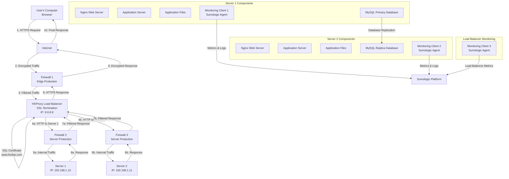

# Secured Three Server Web Infrastructure Design

## Infrastructure Overview

## Security and Monitoring Components

### Firewalls Added (3 Total)

**Firewall 1 - Edge/Perimeter Firewall**
- **Location**: Between internet and load balancer
- **Purpose**: First line of defense against external threats
- **Rules**: 
  - Allow HTTPS (port 443) and HTTP (port 80) traffic
  - Block malicious IPs, DDoS protection
  - Rate limiting to prevent abuse
  - Geographic filtering if needed

**Firewall 2 - Server 1 Protection**
- **Location**: Between load balancer and Server 1
- **Purpose**: Internal network segmentation and protection
- **Rules**:
  - Allow only traffic from load balancer
  - Block direct external access to server
  - Allow database replication traffic to Server 2

**Firewall 3 - Server 2 Protection**
- **Location**: Between load balancer and Server 2
- **Purpose**: Internal network segmentation and protection
- **Rules**:
  - Allow only traffic from load balancer
  - Block direct external access to server
  - Allow database replication traffic from Server 1

### SSL Certificate Implementation
- **Certificate**: Valid SSL certificate for `www.foobar.com`
- **Installation**: Deployed on HAProxy load balancer
- **Encryption**: TLS 1.3 for maximum security
- **Automatic renewal**: Let's Encrypt or commercial CA

### Monitoring Clients (3 Total)

**Monitoring Client 1 - Server 1**
- **Agent**: Sumologic collector on Server 1
- **Data Collection**: System metrics, application logs, database performance
- **Metrics**: CPU, RAM, disk usage, network traffic

**Monitoring Client 2 - Server 2**
- **Agent**: Sumologic collector on Server 2
- **Data Collection**: System metrics, application logs, database replication status
- **Metrics**: CPU, RAM, disk usage, network traffic, replication lag

**Monitoring Client 3 - Load Balancer**
- **Agent**: Sumologic collector on HAProxy server
- **Data Collection**: Load balancer metrics, SSL performance, traffic patterns
- **Metrics**: Request count, response times, backend server health

## Component Explanations

### Why Add Firewalls?

**What firewalls do**:
- Block bad traffic and allow good traffic
- Prevent hackers from accessing servers directly  
- Stop attacks like DDoS before they reach your servers
- Control which ports and services are accessible

**How they help**:
- Create layers of protection (if one fails, others still protect)
- Keep internal servers hidden from the internet
- Filter out malicious requests automatically

### Why Serve Traffic Over HTTPS?

**Security benefits**:
- Encrypts data between user and server so nobody can read it
- Proves your website is legitimate (not a fake copy)
- Prevents data from being changed while traveling over the internet
- Makes users trust your site (they see the lock icon)

**How it works**:
- User connects to your site
- Server shows SSL certificate to prove it's real
- Encrypted connection established for all communication

### What Monitoring is Used For

**Monitoring Purposes**:
- **Performance Tracking**: Monitor response times, throughput, resource usage
- **Health Monitoring**: Detect server failures, service outages
- **Capacity Planning**: Track resource utilization trends for scaling decisions
- **Security Monitoring**: Detect suspicious activities, intrusion attempts
- **Troubleshooting**: Identify root causes of issues quickly
- **Compliance**: Meet audit requirements with detailed logging

### How Monitoring Tool Collects Data

**Data Collection Methods**:
1. **Agent-Based**: Sumologic agents installed on each server
2. **Log Forwarding**: Agents tail log files and forward to central platform
3. **Metrics Collection**: Agents gather system and application metrics
4. **API Integration**: Direct integration with applications for custom metrics
5. **Network Monitoring**: Monitor network traffic and connectivity

**Data Flow**:
- Agents collect data locally on each server
- Data compressed and encrypted before transmission
- Sent to Sumologic cloud platform for analysis
- Real-time dashboards and alerting configured

### Monitoring Web Server QPS (Queries Per Second)

**To Monitor QPS**:
1. **Configure Nginx Logging**: Enable access logs with timestamp data
2. **Log Analysis**: Use Sumologic query language to count requests per second
3. **Custom Metrics**: Create dashboard showing QPS trends
4. **Alerting**: Set up alerts for QPS thresholds (high/low traffic)
5. **Query Example**: `_sourceCategory=nginx | timeslice 1s | count by _timeslice`

**Additional QPS Monitoring**:
- Application server QPS (database queries)
- Load balancer request distribution
- Error rate monitoring alongside QPS

## Infrastructure Issues

### Issue 1: SSL Termination at Load Balancer Level

**Problems**:
- **Unencrypted Internal Traffic**: Traffic between load balancer and servers is HTTP (plain text)
- **Security Gap**: Internal network traffic vulnerable to interception
- **Compliance Issues**: Some regulations require end-to-end encryption
- **Single Point of Failure**: SSL processing concentrated on load balancer

**Risks**:
- Network sniffing on internal segments
- Compromised internal systems can intercept data
- Regulatory compliance violations

**Solutions**:
- Implement end-to-end encryption (SSL re-encryption to backend servers)
- Use VPN or encrypted tunnels for internal communication
- Deploy Web Application Firewall (WAF) for additional protection

### Issue 2: Single MySQL Write Server

**Problems**:
- **Write Bottleneck**: All write operations must go through Primary database
- **Single Point of Failure**: If Primary fails, no write operations possible
- **Scalability Limitation**: Cannot scale write operations horizontally
- **Performance Impact**: Heavy write loads can affect read performance

**Consequences**:
- Application cannot save data if Primary database fails
- Write performance degrades under high load
- Manual failover required, causing downtime

**Solutions**:
- Implement MySQL Galera Cluster for multi-master replication
- Use database sharding to distribute writes
- Implement automatic failover with promotion of Replica to Primary
- Consider NoSQL databases for specific high-write use cases

### Issue 3: Identical Server Components

**Problems**:
- **Resource Inefficiency**: All servers running identical services regardless of actual needs
- **Scaling Inflexibility**: Cannot scale individual components independently
- **Blast Radius**: Problems affect entire application stack on each server
- **Maintenance Complexity**: Updates require coordinating entire stack

**Specific Issues**:
- Web server resources wasted on database server
- Database resources wasted on web-only operations
- Application updates affect database stability
- Cannot optimize servers for specific workloads

**Better Architecture**:
- **Separation of Concerns**: Dedicated web servers, app servers, database servers
- **Horizontal Scaling**: Scale each tier independently based on demand
- **Specialized Optimization**: Optimize each server type for its specific role
- **Fault Isolation**: Issues in one tier don't directly impact others

## Recommended Improvements

### Service Separation
- **Web Tier**: Dedicated Nginx servers for static content and load balancing
- **Application Tier**: Dedicated application servers for business logic
- **Database Tier**: Dedicated MySQL cluster with proper high availability

### Enhanced Security
- **End-to-end Encryption**: SSL between all components
- **Network Segmentation**: VLANs and micro-segmentation
- **Intrusion Detection**: Real-time security monitoring

### Advanced Monitoring
- **Application Performance Monitoring (APM)**: Detailed application tracing
- **Real User Monitoring (RUM)**: Monitor actual user experience
- **Synthetic Monitoring**: Proactive testing of critical user journeys

## Summary

This secured infrastructure addresses the major security and operational concerns of the previous design through firewalls, SSL encryption, and comprehensive monitoring. However, architectural issues around SSL termination, single-write database bottlenecks, and monolithic server design still present scalability and resilience challenges that would need to be addressed for a truly production-ready system.