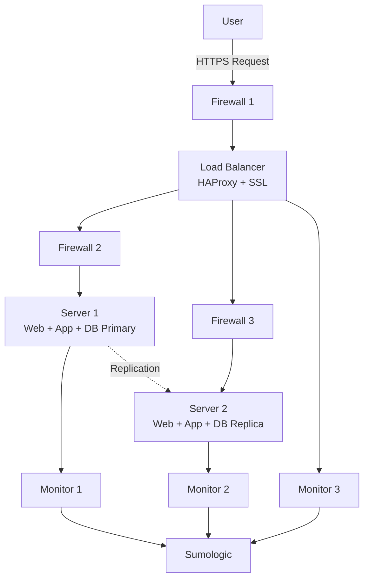

# Secured Three Server Web Infrastructure Design

## Infrastructure Overview

## Security and Monitoring Components

### Firewalls Added (3 Total)
- **Firewall 1**: Protects load balancer from internet attacks
- **Firewall 2**: Protects Server 1 from unauthorized access  
- **Firewall 3**: Protects Server 2 from unauthorized access

### SSL Certificate
- Installed on HAProxy load balancer
- Encrypts all traffic to/from www.foobar.com

### Monitoring Clients (3 Total)
- **Monitor 1**: Watches Server 1 performance and logs
- **Monitor 2**: Watches Server 2 performance and logs
- **Monitor 3**: Watches load balancer performance and logs

## Component Explanations

### Why Add Firewalls?
Block bad traffic and allow good traffic. Prevent hackers from accessing servers directly. Create layers of protection - if one fails, others still protect.

### Why Serve Traffic Over HTTPS?
Encrypts data so nobody can read it. Proves your website is legitimate. Makes users trust your site with the lock icon.

### What Monitoring is Used For
Check if servers are healthy. See how fast the website responds. Get alerts when something breaks. Plan when we need more servers.

### How Monitoring Collects Data
Install software on each server that watches performance and sends data to central platform (Sumologic). Platform creates charts and alerts.

### Monitoring Web Server QPS
Configure web server to log all requests. Monitoring tool counts requests per second and shows trends. Set alerts if traffic gets too high or low.

## Infrastructure Issues

### SSL Termination at Load Balancer
**Problem**: Traffic between load balancer and servers is unencrypted (HTTP). Internal network traffic can be intercepted.
**Solution**: Use end-to-end encryption or secure internal networks.

### Single MySQL Write Server  
**Problem**: Only one server can write to database. If it fails, no data can be saved.
**Solution**: Use database clustering or automatic failover.

### Identical Server Components
**Problem**: All servers run the same services whether needed or not. Wastes resources and makes scaling difficult.
**Solution**: Separate web servers, application servers, and database servers into dedicated roles.

## Recommended Improvements

### Service Separation
- **Web Tier**: Dedicated Nginx servers for static content and load balancing
- **Application Tier**: Dedicated application servers for business logic
- **Database Tier**: Dedicated MySQL cluster with proper high availability

### Enhanced Security
- **End-to-end Encryption**: SSL between all components
- **Network Segmentation**: VLANs and micro-segmentation
- **Intrusion Detection**: Real-time security monitoring

### Advanced Monitoring
- **Application Performance Monitoring (APM)**: Detailed application tracing
- **Real User Monitoring (RUM)**: Monitor actual user experience
- **Synthetic Monitoring**: Proactive testing of critical user journeys

## Summary

This secured infrastructure addresses the major security and operational concerns of the previous design through firewalls, SSL encryption, and comprehensive monitoring. However, architectural issues around SSL termination, single-write database bottlenecks, and monolithic server design still present scalability and resilience challenges that would need to be addressed for a truly production-ready system.