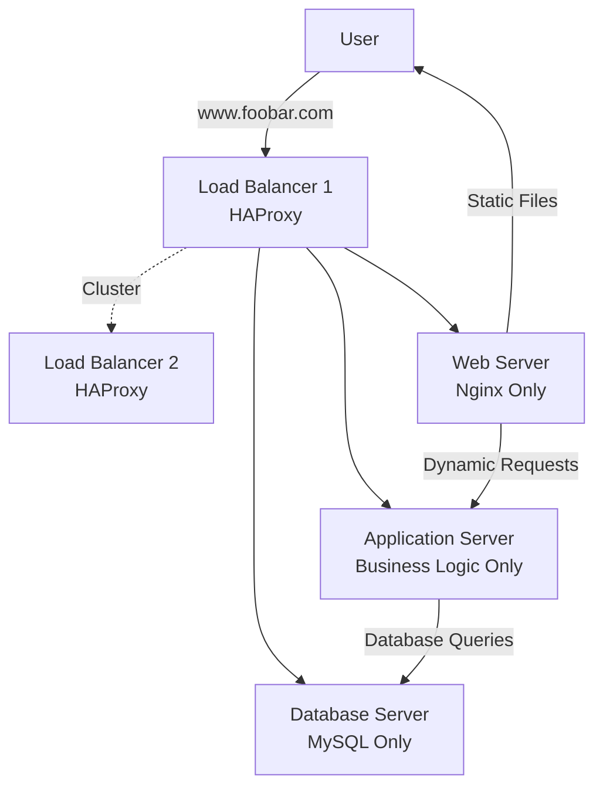

# Separated Components Infrastructure Design

## Infrastructure Overview

## Application Server vs Web Server

### Web Server (Nginx)
- Serves static files (HTML, CSS, images, JavaScript)
- Handles HTTP requests and responses
- Fast at delivering files that don't change

### Application Server
- Runs your business logic and code
- Processes dynamic content that changes based on user input
- Handles user authentication, form processing, calculations

### Key Difference
Web server delivers files. Application server runs programs.

## Components Added

### Clustered Load Balancers
Two HAProxy load balancers working together. If one fails, the other takes over automatically.

### Separate Web Server
Dedicated server only for serving static files. Optimized for fast file delivery.

### Separate Application Server  
Dedicated server only for running application code. Optimized for processing and computation.

### Separate Database Server
Dedicated server only for storing and retrieving data. Optimized for database operations.

## Why Separate Components

### Better Performance
Each server does one job well instead of trying to do everything.

### Independent Scaling
Need more web capacity? Add web servers. Need more database power? Upgrade database server.

### Easier Maintenance
Update application code without affecting web server or database.

### Fault Isolation
If application server crashes, web server can still serve static content.

### Resource Optimization
Database server gets more RAM. Web server gets more network bandwidth. Application server gets more CPU.

## Summary

Separating components allows each server to specialize and perform better. Load balancer clustering removes the single point of failure. This architecture scales better and is more reliable than putting everything on one server.